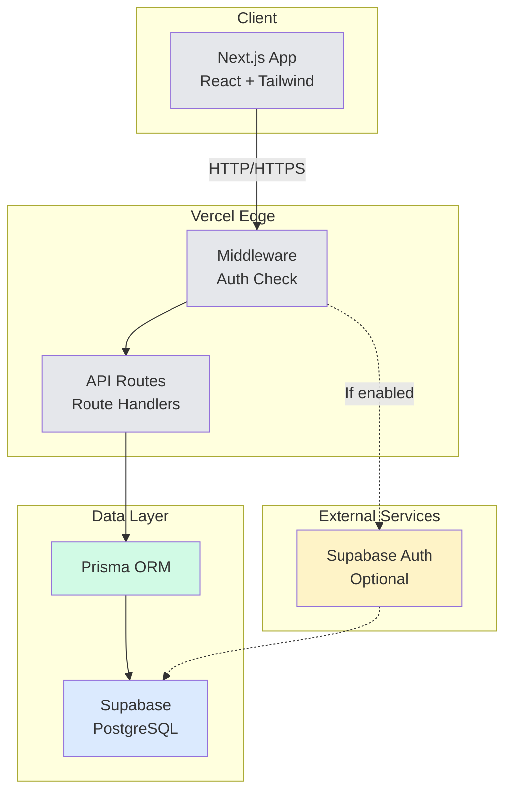
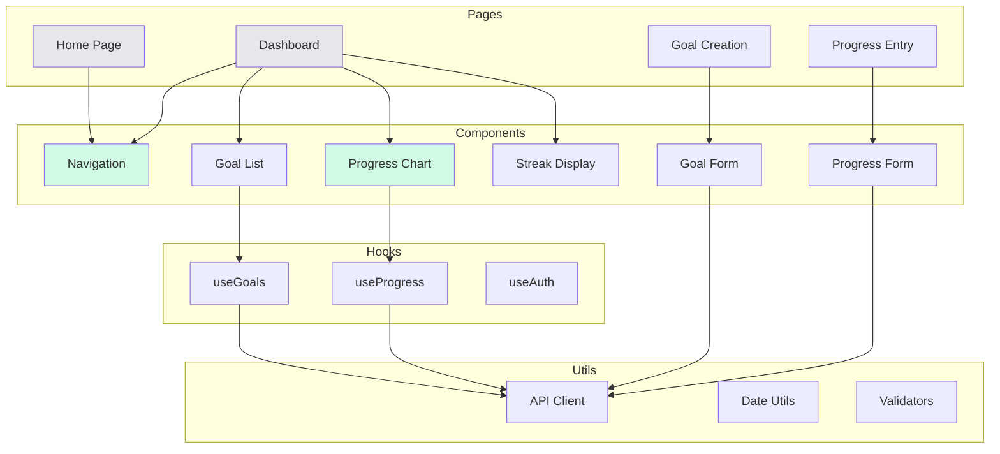

# Architectural Decision Record - MyFitness App v1

**Date**: January 8, 2025  
**Status**: Accepted  
**Deciders**: Development Team  

## Executive Summary

This document outlines the key architectural decisions for MyFitness v1, a minimalist fitness goal tracking application. The architecture prioritizes simplicity, fast iteration, and Vercel deployment compatibility while providing core functionality for goal setting, progress tracking, and visual feedback.

**Related Documents**: This ADR supports the requirements defined in the [Product Requirements Document](./ProductRequirementsDocument.md) and builds upon the goals outlined in the [Opportunity Brief](./OpportunityBrief.md).

## Context and Problem Statement

We need to build a fitness tracking application that:
- Helps users define clear fitness goals using SMART format
- Enables consistent progress tracking
- Provides visual feedback on progress trends
- Deploys easily on Vercel
- Supports mobile-responsive web access
- Minimizes complexity for rapid iteration

These requirements are derived from the detailed problem analysis in the [Product Requirements Document - Product Overview](./ProductRequirementsDocument.md#product-overview) and user research documented in the [Opportunity Brief](./OpportunityBrief.md).

## Decision Drivers

1. **Deployment simplicity**: Must work seamlessly with Vercel
2. **Development velocity**: Fast iteration over robustness
3. **User experience**: Mobile-first, minimal friction
4. **Maintainability**: Limited dependencies, clear architecture
5. **Cost efficiency**: Leverage free tiers where possible

## Architectural Decisions

### 1. Frontend Framework

**Decision**: Next.js 14 with App Router

**Rationale**:
- Native Vercel integration
- Server-side rendering for performance
- API routes for backend logic
- React Server Components for reduced client bundle
- Built-in optimization features

### 2. UI Framework and Styling

**Decision**: Tailwind CSS with shadcn/ui components

**Rationale**:
- Rapid prototyping with utility classes
- Excellent mobile-responsive capabilities
- shadcn/ui provides accessible, customizable components
- Small bundle size with tree-shaking
- No runtime overhead

### 3. Database Solution

**Decision**: Supabase (PostgreSQL)

**Rationale**:
- Managed PostgreSQL with generous free tier
- Built-in authentication (if needed)
- Real-time subscriptions for future features
- Row-level security for data isolation
- Direct API access or use with Prisma ORM
- Easy integration with serverless functions

### 4. Data Access Layer

**Decision**: Prisma ORM with Supabase

**Rationale**:
- Type-safe database queries
- Excellent developer experience
- Database migrations management
- Works well with serverless environments
- Reduces boilerplate code

### 5. Authentication Strategy

**Decision**: Supabase Auth (optional in v1)

**Rationale**:
- Integrated with database solution
- Simple email/password authentication
- Session management handled automatically
- Can be easily toggled on/off for v1
- Upgrade path to OAuth if needed later

### 6. Data Visualization

**Decision**: Recharts

**Rationale**:
- Built specifically for React
- Declarative API matches React patterns
- Responsive by default
- Lighter than Chart.js for basic charts
- Good documentation and community

### 7. State Management

**Decision**: React Context + Server Components

**Rationale**:
- No need for complex state management in v1
- Server Components reduce client-side state
- Context API sufficient for user preferences
- URL state for navigation/filters

### 8. API Design

**Decision**: Next.js Route Handlers with RESTful patterns

**Rationale**:
- Co-located with pages
- Automatic API route generation
- TypeScript support throughout
- Easy to test and maintain
- Natural progression to tRPC if needed

### 9. Testing Strategy

**Decision**: Playwright for E2E testing

**Rationale**:
- Browser-based automated testing as specified
- Visual regression testing capabilities
- Works well with Vercel preview deployments
- Can test mobile responsive layouts

### 10. Development Workflow

**Decision**: Git with feature branches + Vercel preview deployments

**Rationale**:
- Each PR gets automatic preview deployment
- Easy rollback capabilities
- Supports continuous testing philosophy
- Natural CI/CD with Vercel

## Data Model

```typescript
// Core entities
interface User {
  id: string
  email?: string
  createdAt: Date
}

interface Goal {
  id: string
  userId: string
  type: 'strength' | 'cardio' | 'body' | 'habit'
  specificGoal: string
  targetDate: Date
  frequency: string
  status: 'active' | 'completed' | 'paused'
  createdAt: Date
  updatedAt: Date
}

interface Progress {
  id: string
  goalId: string
  value: number
  unit: string
  note?: string
  recordedAt: Date
}
```

*Note: This data model implements the database schema detailed in [PRD Appendix C: Database Schema](./ProductRequirementsDocument.md#c-database-schema).*

## Architecture Diagram



## Component Architecture



## Security Considerations

1. **Data Access**: Row-level security in Supabase
2. **API Protection**: Middleware for auth checks
3. **Input Validation**: Zod schemas for all user inputs
4. **CORS**: Properly configured for Vercel deployment
5. **Environment Variables**: Secure storage in Vercel

*Note: These security measures implement the requirements specified in [PRD NFR-4: Security](./ProductRequirementsDocument.md#nfr-4-security).*

## Performance Targets

- **Initial Load**: < 3s on 3G
- **Interaction Delay**: < 100ms
- **API Response**: < 500ms
- **Lighthouse Score**: > 90 for mobile

*Note: These targets align with the performance requirements defined in [PRD NFR-1: Performance](./ProductRequirementsDocument.md#nfr-1-performance).*

## Migration Path to v2

1. **Mobile App**: React Native with shared business logic
2. **Advanced Analytics**: Dedicated analytics service
3. **Social Features**: Real-time subscriptions ready
4. **AI Coaching**: API structure supports additional endpoints

## Risks and Mitigations

| Risk | Impact | Mitigation |
|------|--------|------------|
| Supabase free tier limits | Service disruption | Monitor usage, upgrade path ready |
| Complex state management | Technical debt | Start simple, refactor when needed |
| Mobile app demand | User retention | PWA capabilities as stopgap |

## Decision Consequences

**Positive**:
- Rapid development and deployment
- Low operational overhead
- Clear upgrade paths
- Excellent developer experience

**Negative**:
- Limited offline capabilities in v1
- No native mobile experience initially
- Dependency on third-party services

## References

### Project Documentation
- [Opportunity Brief](./OpportunityBrief.md) - Problem definition and user research
- [Product Requirements Document](./ProductRequirementsDocument.md) - Detailed requirements and specifications
- [README](./README.md) - Project overview and setup instructions

### Technical Documentation
- [Next.js Documentation](https://nextjs.org/docs)
- [Supabase Documentation](https://supabase.com/docs)
- [Vercel Deployment Guide](https://vercel.com/docs)
- [Tailwind CSS](https://tailwindcss.com)
- [shadcn/ui](https://ui.shadcn.com)
- [Recharts](https://recharts.org)
- [Prisma](https://www.prisma.io/docs)