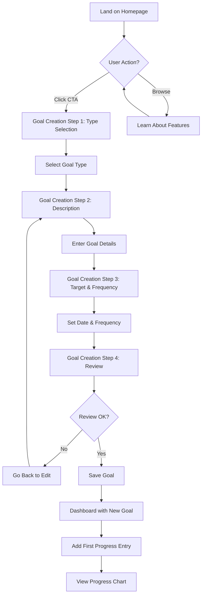
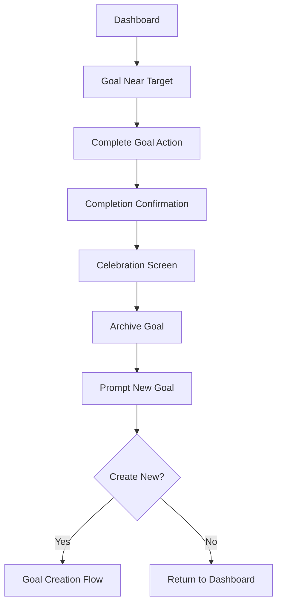

# Interactive Prototypes & Wireframes - MyFitness v1.0

**Document Version**: 1.0  
**Last Updated**: January 8, 2025  
**Purpose**: Interactive prototype specifications for user testing and validation  
**Tool Recommendations**: Figma, Framer, or HTML/CSS prototype  

## Table of Contents
1. [User Flow Diagrams](#user-flow-diagrams)
2. [Interactive Wireframes](#interactive-wireframes)
3. [State Management](#state-management)
4. [Prototype Testing Scenarios](#prototype-testing-scenarios)
5. [User Journey Maps](#user-journey-maps)
6. [Prototype Implementation Guide](#prototype-implementation-guide)

---

## User Flow Diagrams

### Primary User Flow: First-Time Goal Creation


### Secondary User Flow: Daily Progress Tracking
```mermaid
flowchart TD
    A[Open App] --> B[Dashboard]
    B --> C{User Action?}
    C -->|Add Progress| D[Progress Entry Screen]
    C -->|View Chart| E[Progress Chart Screen]
    C -->|Edit Goal| F[Goal Edit Screen]
    
    D --> G[Enter Value]
    G --> H[Select Unit]
    H --> I[Add Note (Optional)]
    I --> J[Save Progress]
    J --> K[Return to Dashboard]
    K --> L[See Updated Progress]
    L --> M[Streak Counter Updates]
```

### Tertiary User Flow: Goal Completion


---

## Interactive Wireframes

### 1. Homepage Interactive Elements

#### Desktop View (1024px+)
```
┌─────────────────────────────────────────────────────────────┐
│ [MyFitness Logo]                    [Login] [Get Started]   │
├─────────────────────────────────────────────────────────────┤
│                                                             │
│         🎯 Define. Track. Achieve.                         │
│                                                             │
│     The simplest way to reach your fitness goals.          │
│                                                             │
│   ┌─────────────────────────────────────────────────────┐   │
│   │ [INTERACTIVE] Start Your Fitness Goal             │   │
│   │ → Hover: Darkens blue, shadow increases           │   │
│   │ → Click: Slides to Goal Creation                   │   │
│   └─────────────────────────────────────────────────────┘   │
│                                                             │
│ ┌─────────────┐ ┌─────────────┐ ┌─────────────┐           │
│ │ ✅ SMART    │ │ 📊 Visual   │ │ 🔥 Streak   │           │
│ │ Goals       │ │ Progress    │ │ Tracking    │           │
│ │ [HOVER]     │ │ [HOVER]     │ │ [HOVER]     │           │
│ └─────────────┘ └─────────────┘ └─────────────┘           │
│                                                             │
│   ┌─────────────────────────────────────────────────────┐   │
│   │ [INTERACTIVE] Try Demo (No Account Needed)        │   │
│   │ → Click: Opens demo with sample data               │   │
│   └─────────────────────────────────────────────────────┘   │
│                                                             │
└─────────────────────────────────────────────────────────────┘
```

#### Interactions Map
```javascript
// Homepage Interactions
const homepageInteractions = {
  primaryCTA: {
    element: "Start Your Fitness Goal",
    states: {
      default: "bg-blue-600 shadow-lg",
      hover: "bg-blue-700 shadow-xl transform scale-105",
      click: "bg-blue-800 shadow-inner"
    },
    action: "Navigate to /goal-creation",
    analytics: "track('cta_clicked', { source: 'homepage' })"
  },
  
  demoButton: {
    element: "Try Demo",
    states: {
      default: "border-2 border-blue-600 text-blue-600",
      hover: "bg-blue-50 border-blue-700",
      click: "bg-blue-100"
    },
    action: "Load demo data, Navigate to /dashboard",
    analytics: "track('demo_started')"
  },
  
  featureCards: {
    element: "Feature cards",
    states: {
      default: "bg-white shadow-sm",
      hover: "bg-gray-50 shadow-md transform translateY(-2px)",
    },
    action: "Highlight feature, show tooltip",
    analytics: "track('feature_explored', { feature: cardType })"
  }
}
```

### 2. Goal Creation Flow - Interactive States

#### Step 1: Goal Type Selection
```
┌─────────────────────────────────────────────────────────────┐
│ [← Back] Create New Goal                             1/4    │
├─────────────────────────────────────────────────────────────┤
│                                                             │
│ What type of goal would you like to create?                 │
│                                                             │
│ ┌─────────────────────────────────────────────────────────┐ │
│ │ 💪 Strength                                [SELECTED]  │ │
│ │ Build muscle, increase weight lifted                   │ │
│ │ → State: border-blue-500 bg-blue-50 ✓                 │ │
│ └─────────────────────────────────────────────────────────┘ │
│                                                             │
│ ┌─────────────────────────────────────────────────────────┐ │
│ │ 🏃‍♂️ Cardio                                [CLICKABLE]  │ │
│ │ Improve endurance, run faster/further                  │ │
│ │ → Hover: border-gray-300 bg-gray-50                   │ │
│ └─────────────────────────────────────────────────────────┘ │
│                                                             │
│ ┌─────────────────────────────────────────────────────────┐ │
│ │ 📏 Body                                     [CLICKABLE]  │ │
│ │ Track weight, measurements, body changes                │ │
│ │ → Hover: border-gray-300 bg-gray-50                   │ │
│ └─────────────────────────────────────────────────────────┘ │
│                                                             │
│ ┌─────────────────────────────────────────────────────────┐ │
│ │ 🎯 Habit                                   [CLICKABLE]  │ │
│ │ Build consistency, daily routines                       │ │
│ │ → Hover: border-gray-300 bg-gray-50                   │ │
│ └─────────────────────────────────────────────────────────┘ │
│                                                             │
│ ┌─────────────────────────────────────────────────────────┐ │
│ │              [DISABLED] [NEXT - ENABLED]               │ │
│ │ → Next becomes enabled when selection made             │ │
│ └─────────────────────────────────────────────────────────┘ │
│                                                             │
└─────────────────────────────────────────────────────────────┘
```

#### Step 2: Goal Description (Dynamic)
```
┌─────────────────────────────────────────────────────────────┐
│ [← Back] Create New Goal                             2/4    │
├─────────────────────────────────────────────────────────────┤
│                                                             │
│ 💪 Strength Goal Details                                   │
│                                                             │
│ What specifically do you want to achieve?                   │
│                                                             │
│ ┌─────────────────────────────────────────────────────────┐ │
│ │ Bench press 100kg for 5 reps                          │ │
│ │ [REAL-TIME VALIDATION]                          28/200 │ │
│ │ → Character count updates live                          │ │
│ │ → Validation: min 10 chars, max 200 chars             │ │
│ └─────────────────────────────────────────────────────────┘ │
│                                                             │
│ Examples for Strength goals:                                │
│ • "Deadlift 2x my body weight (160kg)"                    │
│ • "Complete 20 pull-ups in a row"                         │
│ • "Squat 120kg for 10 reps"                              │
│ [CLICKABLE EXAMPLES] → Click to populate field             │
│                                                             │
│ ┌─────────────────────────────────────────────────────────┐ │
│ │ [BACK]                             [NEXT - ENABLED]    │ │
│ │ → Next enabled when min chars reached                  │ │
│ └─────────────────────────────────────────────────────────┘ │
│                                                             │
└─────────────────────────────────────────────────────────────┘
```

### 3. Dashboard - Interactive Elements

#### Real-time Progress Updates
```
┌─────────────────────────────────────────────────────────────┐
│ MyFitness        🔥 7 days         [👤] [📊] [⚙️]          │
├─────────────────────────────────────────────────────────────┤
│                                                             │
│ [STREAK ANIMATION] Current Streak: 7 days                  │
│ → Flame icon pulses, counter animates on update            │
│                                                             │
│ Active Goals (2/5)                      [+ New Goal]       │
│                                                             │
│ ┌─────────────────────────────────────────────────────────┐ │
│ │ 💪 Bench Press 100kg               [📊] [✏️] [✓]      │ │
│ │ ████████████████░░░░ 80% (80kg/100kg)                 │ │
│ │ → Progress bar animates on data update                 │ │
│ │ Target: Feb 15, 2025 • 3x/week                        │ │
│ │ Last entry: 2 days ago                                │ │
│ │ [HOVER STATE] → Shows quick actions                   │ │
│ └─────────────────────────────────────────────────────────┘ │
│                                                             │
│ ┌─────────────────────────────────────────────────────────┐ │
│ │ 🏃‍♂️ Run 5K                           [📊] [✏️] [✓]      │ │
│ │ ████████░░░░░░░░░░░░ 40% (2km/5km)                     │ │
│ │ Target: Mar 1, 2025 • 5x/week                         │ │
│ │ Last entry: Today                                      │ │
│ │ [URGENT] → 7 days to deadline warning                 │ │
│ └─────────────────────────────────────────────────────────┘ │
│                                                             │
│ ┌─────────────────────────────────────────────────────────┐ │
│ │ [FLOATING ACTION] + Add Progress                       │ │
│ │ → Expands to goal selector on click                    │ │
│ └─────────────────────────────────────────────────────────┘ │
│                                                             │
└─────────────────────────────────────────────────────────────┘
```

---

## State Management

### Application States
```javascript
// Global Application State
const appState = {
  user: {
    id: null,
    isAuthenticated: false,
    preferences: {
      units: 'metric', // 'metric' | 'imperial'
      notifications: true,
      theme: 'light' // 'light' | 'dark'
    }
  },
  
  goals: {
    active: [],
    completed: [],
    loading: false,
    error: null
  },
  
  progress: {
    entries: [],
    loading: false,
    error: null
  },
  
  ui: {
    currentScreen: 'dashboard',
    modals: {
      goalCreation: false,
      progressEntry: false,
      confirmation: false
    },
    notifications: []
  }
}

// UI State Transitions
const stateTransitions = {
  // Goal Creation Flow
  goalCreation: {
    step1: { next: 'step2', prev: 'cancel' },
    step2: { next: 'step3', prev: 'step1' },
    step3: { next: 'step4', prev: 'step2' },
    step4: { next: 'complete', prev: 'step3' }
  },
  
  // Progress Entry States
  progressEntry: {
    selecting: { next: 'entering', prev: 'cancel' },
    entering: { next: 'confirming', prev: 'selecting' },
    confirming: { next: 'complete', prev: 'entering' }
  },
  
  // Dashboard States
  dashboard: {
    loading: { next: 'loaded', prev: null },
    loaded: { next: 'refreshing', prev: null },
    refreshing: { next: 'loaded', prev: null },
    error: { next: 'loaded', prev: null }
  }
}
```

### Component States
```javascript
// Goal Card Component States
const goalCardStates = {
  default: {
    style: "bg-white border-gray-200 shadow-sm",
    actions: ['view', 'edit', 'addProgress']
  },
  
  hover: {
    style: "bg-gray-50 border-gray-300 shadow-md transform scale-102",
    actions: ['view', 'edit', 'addProgress', 'complete']
  },
  
  nearDeadline: {
    style: "bg-yellow-50 border-yellow-300 shadow-sm",
    indicator: "⚠️ 7 days remaining",
    actions: ['view', 'edit', 'addProgress', 'extend']
  },
  
  completed: {
    style: "bg-green-50 border-green-300 shadow-sm",
    indicator: "✅ Completed",
    actions: ['view', 'archive', 'createSimilar']
  }
}

// Progress Entry Component States
const progressEntryStates = {
  empty: {
    validation: false,
    saveEnabled: false,
    placeholder: "Enter your progress..."
  },
  
  valid: {
    validation: true,
    saveEnabled: true,
    feedback: "✓ Ready to save"
  },
  
  invalid: {
    validation: false,
    saveEnabled: false,
    feedback: "⚠️ Please enter a valid number"
  },
  
  saving: {
    validation: true,
    saveEnabled: false,
    feedback: "💾 Saving..."
  }
}
```

---

## Prototype Testing Scenarios

### Scenario 1: New User Onboarding
```
Test: First-time user creates their first goal
Duration: 5-10 minutes
Success Criteria: User completes goal creation without assistance

Steps:
1. User lands on homepage
   → Measure: Time to understand value proposition
   → Success: <30 seconds to click CTA

2. User clicks "Start Your Fitness Goal"
   → Measure: Transition smoothness
   → Success: <2 seconds to load goal creation

3. User selects goal type (Strength)
   → Measure: Selection clarity
   → Success: <10 seconds to make selection

4. User enters goal description
   → Measure: Input ease and validation feedback
   → Success: <60 seconds to complete valid entry

5. User sets target date and frequency
   → Measure: Calendar and frequency selector usability
   → Success: <30 seconds to set both

6. User reviews and confirms goal
   → Measure: Review completeness
   → Success: User doesn't need to edit

7. User lands on dashboard with new goal
   → Measure: First impression of dashboard
   → Success: User understands next steps

Expected Issues:
- Confusion about goal types
- Unclear target date interface
- Overwhelming dashboard for first-time users

Testing Metrics:
- Task completion rate: >80%
- Time to completion: <5 minutes
- Error rate: <2 errors per user
- User satisfaction: >4/5 stars
```

### Scenario 2: Daily Progress Tracking
```
Test: Returning user adds progress to existing goal
Duration: 2-3 minutes
Success Criteria: User completes progress entry efficiently

Steps:
1. User opens app to dashboard
   → Measure: Recognition of existing goals
   → Success: <5 seconds to identify goal to update

2. User clicks "Add Progress" or goal chart icon
   → Measure: Button discoverability
   → Success: <10 seconds to find action

3. User selects correct goal (if multiple)
   → Measure: Goal selection interface
   → Success: <5 seconds to select

4. User enters progress value
   → Measure: Number input usability
   → Success: <20 seconds to enter value

5. User selects unit (if different from last time)
   → Measure: Unit selector efficiency
   → Success: <10 seconds to change unit

6. User adds optional note
   → Measure: Note input value
   → Success: <30 seconds to add meaningful note

7. User saves progress
   → Measure: Save confirmation clarity
   → Success: User feels confident data is saved

8. User sees updated progress on dashboard
   → Measure: Visual feedback effectiveness
   → Success: User notices progress bar/chart update

Expected Issues:
- Forgetting to save progress
- Confusion about units
- Unclear feedback on successful save

Testing Metrics:
- Task completion rate: >95%
- Time to completion: <2 minutes
- Error rate: <1 error per user
- Return usage: >3 times per week
```

### Scenario 3: Goal Completion & Celebration
```
Test: User completes a goal and creates a follow-up
Duration: 3-5 minutes
Success Criteria: User feels accomplishment and continues engagement

Steps:
1. User adds final progress entry that reaches goal
   → Measure: Goal completion detection
   → Success: System recognizes completion automatically

2. User sees completion celebration
   → Measure: Celebration engagement
   → Success: User smiles/feels positive emotion

3. User confirms goal completion
   → Measure: Confirmation process clarity
   → Success: User confidently confirms

4. User reviews goal statistics
   → Measure: Statistics value/interest
   → Success: User spends >10 seconds reviewing

5. User is prompted to create new goal
   → Measure: New goal motivation
   → Success: User clicks "Create New Goal"

6. User creates follow-up goal
   → Measure: Goal creation efficiency (repeat user)
   → Success: <3 minutes to create new goal

Expected Issues:
- Anti-climactic completion experience
- Unclear goal archival process
- Insufficient motivation for new goal

Testing Metrics:
- Completion celebration engagement: >60%
- Follow-up goal creation: >40%
- User satisfaction with completion: >4.5/5
- Continued app usage post-completion: >70%
```

---

## User Journey Maps

### Primary Persona: "Motivated Mark" Journey

#### Week 1: Discovery & Setup
```
Day 1 (Monday):
Touchpoint: Google search "simple fitness tracking"
Emotion: 😐 Frustrated with complex apps
Action: Finds MyFitness, clicks homepage
Experience: Landing page immediately resonates
Outcome: Creates strength goal "Bench 100kg"

Day 2 (Tuesday):
Touchpoint: First workout, opens app
Emotion: 🤔 Uncertain about tracking
Action: Logs 75kg bench press
Experience: Simple entry process, sees progress bar
Outcome: Feels accomplished, streak starts

Day 4 (Thursday):
Touchpoint: Second workout
Emotion: 😊 Getting into routine
Action: Logs 77kg, adds note "felt strong"
Experience: Sees progress chart, 2-day streak
Outcome: Motivated by visual progress

Day 6 (Saturday):
Touchpoint: Third workout
Emotion: 😁 Excited about progress
Action: Logs 78kg, checks chart
Experience: Notices upward trend
Outcome: Shares achievement with friend
```

#### Week 2: Habit Formation
```
Day 8 (Monday):
Touchpoint: Notification reminder
Emotion: 😌 Routine forming
Action: Logs 80kg without hesitation
Experience: 5-day streak celebrated
Outcome: Habit solidifying

Day 10 (Wednesday):
Touchpoint: App usage during rest day
Emotion: 😎 Confident in progress
Action: Reviews chart, plans next session
Experience: Sees clear progress trajectory
Outcome: Adjusts workout plan

Day 13 (Saturday):
Touchpoint: Reaches intermediate milestone
Emotion: 🎉 Excited about halfway point
Action: Logs 82kg, sees 50% progress
Experience: Visual milestone celebration
Outcome: Commits to continuing
```

#### Week 4: Mastery & Expansion
```
Day 25 (Monday):
Touchpoint: Approaching goal deadline
Emotion: 🔥 Determined to succeed
Action: Logs 95kg, sees 95% complete
Experience: Deadline warning, increased focus
Outcome: Plans final push

Day 28 (Thursday):
Touchpoint: Goal completion attempt
Emotion: 😤 Nervous but ready
Action: Logs 100kg - GOAL ACHIEVED!
Experience: Celebration screen, statistics
Outcome: Feels incredible accomplishment

Day 29 (Friday):
Touchpoint: Post-completion reflection
Emotion: 😊 Proud and motivated
Action: Creates new goal "Deadlift 150kg"
Experience: Streamlined creation process
Outcome: Continues fitness journey
```

### Journey Pain Points & Solutions
```
Pain Point: Forgetting to log progress
Solution: Gentle reminder system, streak motivation

Pain Point: Unclear progress visualization
Solution: Multiple chart views, clear percentages

Pain Point: Losing motivation mid-goal
Solution: Milestone celebrations, trend analysis

Pain Point: Goal completion anti-climax
Solution: Achievement celebration, statistics review

Pain Point: Difficulty creating follow-up goals
Solution: Suggested goals, copy previous goal
```

---

## Prototype Implementation Guide

### Technical Requirements
```javascript
// Prototype Framework Recommendations
const prototypeStack = {
  // Option 1: Quick HTML/CSS/JS Prototype
  frontend: 'Vanilla JavaScript',
  styling: 'Tailwind CSS CDN',
  interactions: 'Custom event handlers',
  data: 'LocalStorage',
  timeline: '2-3 days',
  
  // Option 2: React Prototype
  frontend: 'React with Vite',
  styling: 'Tailwind CSS',
  components: 'Headless UI',
  state: 'React State + Context',
  data: 'Mock JSON data',
  timeline: '3-5 days',
  
  // Option 3: Design Tool Prototype
  tool: 'Figma with interactions',
  complexity: 'High-fidelity clickable',
  timeline: '1-2 days',
  limitations: 'No real data handling'
}
```

### Prototype Features Checklist
```markdown
### Core Interactions ✓
- [ ] Homepage CTA click → Goal creation
- [ ] Goal type selection with visual feedback
- [ ] Form validation with real-time feedback
- [ ] Progress bar animations
- [ ] Chart interactions (hover, time ranges)
- [ ] Streak counter updates
- [ ] Modal/screen transitions

### Data Simulation ✓
- [ ] Pre-populated demo goals
- [ ] Realistic progress data
- [ ] Multiple goal types represented
- [ ] Various completion percentages
- [ ] Streak progression simulation

### User Testing Ready ✓
- [ ] Mobile-responsive design
- [ ] Touch-friendly interactions
- [ ] Realistic loading states
- [ ] Error state handling
- [ ] Accessibility features
- [ ] Performance optimization

### Analytics Integration ✓
- [ ] Click tracking on key elements
- [ ] Time-on-screen measurements
- [ ] Task completion tracking
- [ ] User flow analysis
- [ ] Error occurrence logging
```

### Testing Protocol
```markdown
### Pre-Testing Setup
1. Prepare test scenarios with realistic data
2. Set up screen recording for sessions
3. Create task instruction cards
4. Prepare post-test questionnaire
5. Test prototype functionality thoroughly

### During Testing
1. Observe user behavior without interrupting
2. Note hesitations and confusion points
3. Record completion times for key tasks
4. Document any bugs or broken interactions
5. Gather immediate feedback on each screen

### Post-Testing Analysis
1. Analyze completion rates and times
2. Identify common pain points
3. Prioritize issues by severity and frequency
4. Plan design iterations based on findings
5. Document recommendations for development
```

---

## Next Steps

### Immediate Actions
1. **Choose Prototype Platform**: Select between HTML/CSS, React, or Figma based on team capabilities
2. **Implement Core Flows**: Focus on goal creation and progress tracking flows first
3. **Add Sample Data**: Create realistic demo data for testing scenarios
4. **Setup Testing Environment**: Prepare devices and recording tools

### Testing Phase
1. **Internal Testing**: Team members test all flows and interactions
2. **User Testing**: Recruit 5-8 users from target personas
3. **Iterate Based on Feedback**: Implement high-priority improvements
4. **Validate Changes**: Quick follow-up tests with subset of users

### Documentation Updates
1. **Record Findings**: Document all user feedback and issues
2. **Update Requirements**: Revise PRD based on user testing insights
3. **Refine Mockups**: Update UI mockups with validated improvements
4. **Development Handoff**: Package refined designs for implementation

---

**Related Documents:**
- [UI Mockups](./UI-Mockups.md) - Static design specifications
- [Product Requirements Document](./ProductRequirementsDocument.md) - Feature requirements
- [Architectural Decision Record](./ArchitecturalDecisionRecord.md) - Technical implementation
- [Opportunity Brief](./OpportunityBrief.md) - User needs and context

**Success Metrics:**
- 80%+ task completion rate in user testing
- <5 minutes average time for goal creation
- 4.5/5 user satisfaction rating
- 90%+ users understand app purpose within 30 seconds