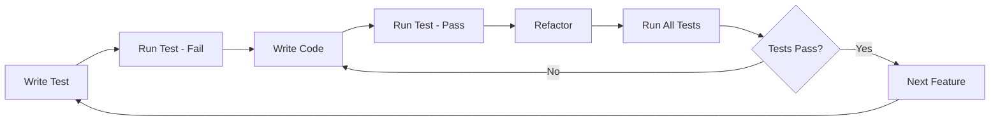
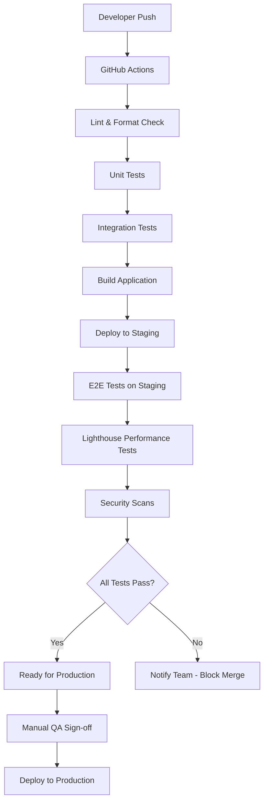
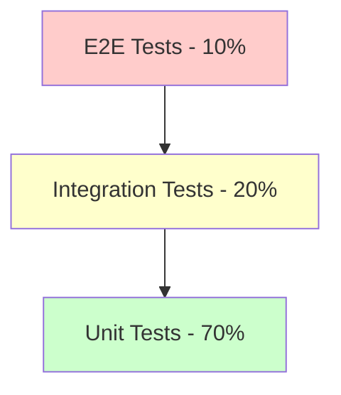

# MyFitness Production Plan v1.0

**Document Version**: 1.0  
**Created**: January 8, 2025  
**Philosophy**: Quality-first development with continuous testing and validation  
**Target**: Production-ready fitness tracking application

## Executive Summary

This production plan outlines a quality-focused development approach for MyFitness v1.0, emphasizing Test-Driven Development (TDD), continuous integration/deployment, and comprehensive browser-based automated testing. The plan is structured around 4 strategic milestones that build incrementally toward a robust, user-tested production application.

**Key Success Metrics:**
- 100% automated test coverage for critical user flows
- <2 second page load times on 3G networks
- 99.9% uptime in production
- >4.5/5 user satisfaction rating
- Zero critical bugs in production

---

## Development Methodology

### Test-Driven Development (TDD) Approach


### CI/CD Pipeline Architecture


### Quality Gates
Every milestone must pass:
- **Code Quality**: ESLint, Prettier, TypeScript strict mode
- **Test Coverage**: >90% line coverage, 100% critical path coverage
- **Performance**: Lighthouse scores >90 mobile, >95 desktop
- **Security**: Automated security scanning with Snyk
- **Accessibility**: axe-core accessibility testing
- **Browser Testing**: Cross-browser compatibility testing
- **🔴 USER TESTING**: Mandatory user testing with target personas at milestone completion

---

## Milestone 1: Foundation & Core Infrastructure
**Duration**: 3-4 weeks  
**Focus**: Robust development foundation with CI/CD and core architecture

### 1.1 Deliverables

#### Infrastructure Setup
- **CI/CD Pipeline**: GitHub Actions workflow with staging deployment
- **Database**: Supabase project with Prisma ORM integration
- **Authentication**: Supabase Auth (optional) with session management
- **Deployment**: Vercel staging environment with preview deployments

*Cross-reference: [ADR Section 3: Database Solution](./ArchitecturalDecisionRecord.md#3-database-solution) and [ADR Section 5: Authentication Strategy](./ArchitecturalDecisionRecord.md#5-authentication-strategy)*

#### Core Application Structure
- **Next.js 14 App**: App Router setup with TypeScript
- **UI Framework**: Tailwind CSS with shadcn/ui components
- **State Management**: React Context for global state
- **API Layer**: Next.js Route Handlers with validation

*Cross-reference: [ADR Section 1: Frontend Framework](./ArchitecturalDecisionRecord.md#1-frontend-framework) and [ADR Section 2: UI Framework](./ArchitecturalDecisionRecord.md#2-ui-framework-and-styling)*

#### Testing Framework
- **Unit Testing**: Jest with React Testing Library
- **E2E Testing**: Playwright for browser automation
- **Performance Testing**: Lighthouse CI integration
- **Database Testing**: Test database with seed data

### 1.2 Key Features (TDD Implementation)

#### Homepage & Navigation
```typescript
// Test-first approach example
describe('Homepage', () => {
  it('should display primary CTA and navigate to goal creation', async () => {
    // Test implementation guides development
  });
});
```

**Features:**
- Landing page with value proposition
- Navigation header with responsive design
- Mobile-first responsive layout
- Basic routing structure

*Cross-reference: [UI Mockups - Landing Page](./UI-Mockups.md#landing-page) and [PRD User Stories US-4.1](./ProductRequirementsDocument.md#us-41-first-time-user-experience)*

#### Database Schema & Models
```prisma
// Implementation follows PRD specifications
model User {
  id        String   @id @default(cuid())
  email     String?  @unique
  goals     Goal[]
  createdAt DateTime @default(now())
}
```

*Cross-reference: [PRD Appendix C: Database Schema](./ProductRequirementsDocument.md#c-database-schema)*

### 1.3 Testing Requirements

#### Automated Browser Testing
```javascript
// Playwright E2E tests
test('User can navigate from homepage to goal creation', async ({ page }) => {
  await page.goto('/');
  await page.click('[data-testid="start-goal-cta"]');
  await expect(page).toHaveURL('/goals/create');
});
```

**Test Coverage:**
- Homepage loading and CTA functionality
- Navigation between core pages
- Responsive design across devices
- Basic accessibility compliance

#### Performance Benchmarks
- First Contentful Paint: <1.5s
- Largest Contentful Paint: <2.5s
- Cumulative Layout Shift: <0.1
- Time to Interactive: <3s

### 1.4 CI/CD Requirements

#### Staging Environment
- Automatic deployment on PR creation
- Environment variables management
- Database migrations automation
- Preview URLs for stakeholder review

#### Quality Checks
- TypeScript compilation
- ESLint and Prettier enforcement
- Security vulnerability scanning
- Bundle size analysis

### 🔴 1.5 MANDATORY USER TESTING - MILESTONE 1

**📊 User Testing Requirements:**
- **Participants**: 5-8 users from target personas (Motivated Mark, Busy Beth)
- **Testing Focus**: Homepage usability, navigation clarity, initial impressions
- **Duration**: 30-45 minutes per session
- **Method**: Moderated remote usability testing with screen recording

**🎯 Key Testing Scenarios:**
1. **Homepage Understanding**: Can users understand the value proposition within 30 seconds?
2. **CTA Clarity**: Do users know what "Start Your Fitness Goal" means?
3. **Navigation Discovery**: Can users find key sections without guidance?
4. **Mobile Experience**: Is the mobile experience intuitive and fast?

**✅ Success Criteria:**
- 80% of users understand app purpose within 30 seconds
- 90% of users can successfully click primary CTA
- Average task completion time <2 minutes
- User satisfaction rating >4/5

**🚨 BLOCKING REQUIREMENT**: Milestone 1 cannot proceed to Milestone 2 until user testing is completed and success criteria are met.

*Cross-reference: [Interactive Prototypes - Prototype Testing Scenarios](./InteractivePrototypes.md#prototype-testing-scenarios)*

---

## Milestone 2: Goal Management & Basic Tracking
**Duration**: 4-5 weeks  
**Focus**: Core goal creation and basic progress tracking functionality

### 2.1 Deliverables

#### Goal Management System
- **Goal Creation Flow**: 4-step wizard with validation
- **Goal Types**: Strength, Cardio, Body, Habit categories
- **SMART Goal Format**: Validation and guidance
- **Goal Dashboard**: Active goals display with progress

*Cross-reference: [PRD Epic 1: Goal Management](./ProductRequirementsDocument.md#epic-1-goal-management) and [ADR Data Model](./ArchitecturalDecisionRecord.md#data-model)*

#### Progress Tracking Foundation
- **Progress Entry**: Numeric input with units
- **Data Validation**: Real-time validation with Zod schemas
- **Basic Analytics**: Simple calculations for progress percentage
- **Data Storage**: Optimized database queries with Prisma

*Cross-reference: [PRD Epic 2: Progress Tracking](./ProductRequirementsDocument.md#epic-2-progress-tracking)*

### 2.2 Key Features (TDD Implementation)

#### Goal Creation Wizard
```typescript
// TDD approach for goal creation
describe('Goal Creation Flow', () => {
  it('should validate SMART goal format', async () => {
    // Test drives validation logic
  });
  
  it('should save goal with correct data structure', async () => {
    // Test drives database operations
  });
});
```

**Features:**
- Step-by-step goal creation (4 steps)
- Goal type selection with examples
- Target date and frequency setting
- Goal validation and confirmation

*Cross-reference: [UI Mockups - Goal Creation](./UI-Mockups.md#goal-creation) and [Interactive Prototypes - Goal Creation Flow](./InteractivePrototypes.md#step-by-step-flow)*

#### Dashboard with Goal Cards
```typescript
// Component testing approach
describe('Goal Dashboard', () => {
  it('should display active goals with progress bars', async () => {
    // Test UI components and state management
  });
});
```

**Features:**
- Goal cards with progress visualization
- Quick actions (edit, add progress)
- Empty state handling
- Goal filtering and sorting

*Cross-reference: [UI Mockups - Dashboard](./UI-Mockups.md#dashboard)*

#### Progress Entry System
**Features:**
- Large numeric input for mobile
- Unit selection (kg, lbs, reps, etc.)
- Optional notes (140 characters)
- Recent entries display

*Cross-reference: [PRD FR-2: Progress Tracking System](./ProductRequirementsDocument.md#fr-2-progress-tracking-system)*

### 2.3 Testing Requirements

#### Automated Browser Testing
```javascript
// Comprehensive E2E testing
test('Complete goal creation and progress entry flow', async ({ page }) => {
  // Test entire user journey
  await createGoal(page, 'Strength', 'Bench press 100kg');
  await addProgress(page, 75, 'kg');
  await verifyProgressDisplay(page, '75%');
});
```

**Test Scenarios:**
- Goal creation with all types
- Form validation and error handling
- Progress entry with different units
- Dashboard state updates
- Mobile responsiveness

#### API Testing
- Goal CRUD operations
- Progress entry validation
- Data integrity checks
- Error handling scenarios

### 2.4 Performance Requirements

#### Database Optimization
- Efficient queries with proper indexing
- Connection pooling configuration
- Query optimization with Prisma

#### Frontend Performance
- Component lazy loading
- Optimized bundle splitting
- Image optimization

### 🔴 2.5 MANDATORY USER TESTING - MILESTONE 2

**📊 User Testing Requirements:**
- **Participants**: 8-10 users from target personas (including returning users from Milestone 1)
- **Testing Focus**: Goal creation flow, progress tracking, dashboard usability
- **Duration**: 45-60 minutes per session
- **Method**: Moderated usability testing with think-aloud protocol

**🎯 Key Testing Scenarios:**
1. **Goal Creation Flow**: Can users complete the 4-step goal creation wizard without assistance?
2. **Progress Entry**: Is the progress tracking interface intuitive and efficient?
3. **Dashboard Comprehension**: Do users understand their progress at a glance?
4. **Error Recovery**: Can users recover from validation errors gracefully?

**✅ Success Criteria:**
- 90% of users complete goal creation within 5 minutes
- 95% of users successfully add progress entry within 2 minutes
- Average user satisfaction rating >4.2/5
- <2 usability issues per user session

**🚨 BLOCKING REQUIREMENT**: Milestone 2 cannot proceed to Milestone 3 until user testing is completed and success criteria are met.

*Cross-reference: [Interactive Prototypes - Scenario 1: New User Onboarding](./InteractivePrototypes.md#scenario-1-new-user-onboarding) and [Interactive Prototypes - Scenario 2: Daily Progress Tracking](./InteractivePrototypes.md#scenario-2-daily-progress-tracking)*

---

## Milestone 3: Progress Visualization & Advanced Features
**Duration**: 3-4 weeks  
**Focus**: Data visualization, streak tracking, and enhanced user experience

### 3.1 Deliverables

#### Data Visualization
- **Progress Charts**: Interactive line charts with Recharts
- **Multiple Time Ranges**: 7D, 1M, 3M, All time views
- **Goal Target Lines**: Visual goal tracking
- **Trend Analysis**: Progress trajectory calculations

*Cross-reference: [ADR Section 6: Data Visualization](./ArchitecturalDecisionRecord.md#6-data-visualization) and [PRD FR-3: Data Visualization](./ProductRequirementsDocument.md#fr-3-data-visualization)*

#### Streak Tracking System
- **Streak Calculations**: Based on goal frequency
- **Visual Streak Display**: Animated streak counter
- **Milestone Celebrations**: 7, 30, 100-day milestones
- **Grace Period Logic**: 1-day grace for missed entries

*Cross-reference: [PRD US-2.3: Streak Tracking](./ProductRequirementsDocument.md#us-23-streak-tracking)*

#### Enhanced User Experience
- **Goal Completion Flow**: Celebration and archival
- **Data Export**: CSV export functionality
- **Performance Optimization**: Loading states and caching
- **Accessibility Improvements**: WCAG 2.1 AA compliance

### 3.2 Key Features (TDD Implementation)

#### Interactive Charts
```typescript
// Chart component testing
describe('Progress Chart', () => {
  it('should display progress data with target line', async () => {
    // Test chart rendering and interactions
  });
  
  it('should handle different time ranges', async () => {
    // Test time range filtering
  });
});
```

**Features:**
- Responsive chart rendering
- Hover interactions and tooltips
- Time range selection
- Export chart functionality

*Cross-reference: [UI Mockups - Progress Chart](./UI-Mockups.md#progress-chart)*

#### Streak Tracking Logic
```typescript
// Streak calculation testing
describe('Streak Calculator', () => {
  it('should calculate streak based on goal frequency', async () => {
    // Test streak logic with various scenarios
  });
});
```

**Features:**
- Frequency-based streak calculation
- Visual streak indicators
- Milestone celebrations
- Streak history tracking

#### Goal Completion System
**Features:**
- Completion detection and confirmation
- Achievement statistics
- Goal archival process
- Follow-up goal suggestions

*Cross-reference: [PRD US-1.4: Complete/Archive Goal](./ProductRequirementsDocument.md#us-14-completearchive-goal)*

### 3.3 Testing Requirements

#### Advanced E2E Testing
```javascript
// Complex user journey testing
test('Complete user journey with goal completion', async ({ page }) => {
  await completeGoalJourney(page);
  await verifyStreakCalculation(page);
  await testGoalCompletion(page);
});
```

**Test Coverage:**
- Chart interactions and data accuracy
- Streak calculations with various frequencies
- Goal completion celebrations
- Data export functionality
- Cross-browser compatibility

#### Performance Testing
- Chart rendering performance
- Large dataset handling
- Memory usage optimization
- Mobile performance validation

### 3.4 Accessibility & UX Requirements

#### Accessibility Testing
- Screen reader compatibility
- Keyboard navigation
- Color contrast validation
- Focus management

### 🔴 3.5 MANDATORY USER TESTING - MILESTONE 3

**📊 User Testing Requirements:**
- **Participants**: 10-12 users including existing users from previous milestones
- **Testing Focus**: Progress visualization, streak tracking, goal completion flow
- **Duration**: 60-75 minutes per session
- **Method**: Moderated usability testing with A/B testing for chart interactions

**🎯 Key Testing Scenarios:**
1. **Progress Chart Comprehension**: Do users understand their progress trends and target lines?
2. **Streak Motivation**: Does the streak system motivate continued usage?
3. **Goal Completion Flow**: Is the goal completion celebration meaningful and motivating?
4. **Data Export Usage**: Can users successfully export their data?

**✅ Success Criteria:**
- 85% of users can interpret progress charts correctly
- 90% of users find streak tracking motivating
- 95% of users successfully complete goal completion flow
- Average user satisfaction rating >4.5/5
- <1 critical usability issue per user session

**🚨 BLOCKING REQUIREMENT**: Milestone 3 cannot proceed to Milestone 4 until user testing is completed and success criteria are met.

*Cross-reference: [Interactive Prototypes - Scenario 3: Goal Completion & Celebration](./InteractivePrototypes.md#scenario-3-goal-completion--celebration)*

#### Additional User Experience Validation
- Performance testing on slow networks with real users
- Mobile gesture support validation
- Error state handling with user feedback
- Accessibility testing with assistive technology users

---

## Milestone 4: Production Launch & Optimization
**Duration**: 2-3 weeks  
**Focus**: Production readiness, monitoring, and launch preparation

### 4.1 Deliverables

#### Production Environment Setup
- **Production Deployment**: Vercel production environment
- **Monitoring**: Application performance monitoring
- **Error Tracking**: Sentry integration for error monitoring
- **Analytics**: User behavior tracking

#### Security & Compliance
- **Security Hardening**: Input sanitization and validation
- **HTTPS Configuration**: SSL/TLS setup
- **Rate Limiting**: API protection
- **Data Privacy**: GDPR compliance considerations

*Cross-reference: [ADR Security Considerations](./ArchitecturalDecisionRecord.md#security-considerations) and [PRD NFR-4: Security](./ProductRequirementsDocument.md#nfr-4-security)*

#### Performance Optimization
- **Bundle Optimization**: Code splitting and lazy loading
- **Caching Strategy**: Static asset and API caching
- **Database Optimization**: Query optimization and indexing
- **CDN Configuration**: Asset delivery optimization

*Cross-reference: [PRD NFR-1: Performance](./ProductRequirementsDocument.md#nfr-1-performance)*

### 4.2 Key Features (TDD Implementation)

#### Production Monitoring
```typescript
// Monitoring and alerting tests
describe('Production Monitoring', () => {
  it('should track key performance metrics', async () => {
    // Test monitoring setup
  });
});
```

**Features:**
- Real-time performance monitoring
- Error rate tracking
- User engagement metrics
- Database performance monitoring

#### Advanced Security
**Features:**
- Input validation and sanitization
- CSRF protection
- SQL injection prevention
- Rate limiting implementation

### 4.3 Testing Requirements

#### Production Readiness Testing
```javascript
// Production environment testing
test('Production environment health checks', async ({ page }) => {
  await validateProductionPerformance(page);
  await testSecurityMeasures(page);
  await verifyMonitoringSetup(page);
});
```

**Test Coverage:**
- End-to-end production testing
- Load testing with realistic user volumes
- Security vulnerability scanning
- Backup and recovery testing
- Disaster recovery procedures

#### User Acceptance Testing
- Beta user testing with real users
- Performance validation on various devices
- Accessibility testing with assistive technologies
- Cross-browser compatibility verification

### 4.4 Launch Preparation

#### Go-Live Checklist
- [ ] All automated tests passing
- [ ] Performance benchmarks met
- [ ] Security audit completed
- [ ] Monitoring and alerting configured
- [ ] Backup procedures tested
- [ ] DNS and domain configuration
- [ ] SSL certificate installed
- [ ] CDN configured
- [ ] Error tracking active
- [ ] Analytics implementation verified

#### Post-Launch Monitoring
- 24/7 monitoring for first 48 hours
- Performance metric tracking
- User feedback collection
- Bug triage and resolution process

### 🔴 4.5 MANDATORY USER TESTING - MILESTONE 4

**📊 User Testing Requirements:**
- **Participants**: 15-20 users including beta testers and new users
- **Testing Focus**: Production readiness, performance validation, full user journey
- **Duration**: 90-120 minutes per session
- **Method**: Comprehensive user acceptance testing with real-world scenarios

**🎯 Key Testing Scenarios:**
1. **Complete User Journey**: Can users accomplish all primary tasks from start to finish?
2. **Performance Validation**: Does the app perform well under real-world conditions?
3. **Production Environment**: Are there any issues specific to the production environment?
4. **Cross-Device Experience**: Is the experience consistent across all devices and browsers?

**✅ Success Criteria:**
- 95% of users successfully complete primary user journeys
- 98% of users report satisfactory performance
- Average user satisfaction rating >4.7/5
- Zero critical bugs discovered during testing
- <30 second average task completion time for core features

**🚨 BLOCKING REQUIREMENT**: Production launch cannot proceed until user testing is completed, success criteria are met, and all identified issues are resolved.

*Cross-reference: [Interactive Prototypes - Full User Journey Testing](./InteractivePrototypes.md#full-user-journey-testing)*

**🎯 Additional Production Readiness Testing:**
- **Stress Testing**: Test with concurrent users to validate performance
- **Security Testing**: Penetration testing and vulnerability assessment
- **Accessibility Testing**: Testing with assistive technology users
- **Cross-Browser Testing**: Comprehensive testing across all supported browsers and devices

---

## Continuous Integration/Deployment (CI/CD) Implementation

### GitHub Actions Workflow
```yaml
# .github/workflows/ci-cd.yml
name: CI/CD Pipeline

on:
  push:
    branches: [ main, develop ]
  pull_request:
    branches: [ main ]

jobs:
  test:
    runs-on: ubuntu-latest
    steps:
      - name: Checkout code
        uses: actions/checkout@v3
      
      - name: Setup Node.js
        uses: actions/setup-node@v3
        with:
          node-version: '18'
          cache: 'npm'
      
      - name: Install dependencies
        run: npm ci
      
      - name: Run linting
        run: npm run lint
      
      - name: Run type checking
        run: npm run type-check
      
      - name: Run unit tests
        run: npm run test:unit
      
      - name: Run integration tests
        run: npm run test:integration
      
      - name: Build application
        run: npm run build
      
      - name: Deploy to staging
        if: github.ref == 'refs/heads/develop'
        run: |
          npx vercel --prod --token ${{ secrets.VERCEL_TOKEN }}
      
      - name: Run E2E tests
        run: npm run test:e2e
      
      - name: Run performance tests
        run: npm run test:performance
      
      - name: Security scan
        run: npm audit --audit-level moderate
```

### Staging Environment Configuration
- **Automatic Deployment**: Every PR gets a preview deployment
- **Environment Variables**: Secure secrets management
- **Database**: Staging database with production-like data
- **Testing**: Automated testing on every deployment

### Production Deployment
- **Blue-Green Deployment**: Zero-downtime deployments
- **Rollback Strategy**: Immediate rollback capability
- **Health Checks**: Automated health verification
- **Monitoring**: Real-time performance monitoring

---

## Browser-Based Automated Testing Strategy

### Playwright Testing Framework
```typescript
// tests/e2e/user-journey.spec.ts
import { test, expect } from '@playwright/test';

test.describe('Complete User Journey', () => {
  test('New user creates goal and tracks progress', async ({ page }) => {
    // Test complete user workflow
    await page.goto('/');
    
    // Homepage interaction
    await page.click('[data-testid="start-goal-cta"]');
    await expect(page).toHaveURL('/goals/create');
    
    // Goal creation flow
    await page.click('[data-testid="goal-type-strength"]');
    await page.click('[data-testid="next-step"]');
    
    await page.fill('[data-testid="goal-description"]', 'Bench press 100kg');
    await page.click('[data-testid="next-step"]');
    
    // Continue through complete flow...
  });
});
```

### Cross-Browser Testing
- **Chrome**: Latest version
- **Firefox**: Latest version
- **Safari**: Latest version
- **Edge**: Latest version
- **Mobile**: iOS Safari, Chrome Android

### Performance Testing
```typescript
// Performance testing with Lighthouse
test('Performance benchmarks', async ({ page }) => {
  await page.goto('/');
  
  const metrics = await page.evaluate(() => {
    return {
      fcp: performance.getEntriesByType('paint')[0].startTime,
      lcp: performance.getEntriesByType('largest-contentful-paint')[0].startTime
    };
  });
  
  expect(metrics.fcp).toBeLessThan(1500); // First Contentful Paint
  expect(metrics.lcp).toBeLessThan(2500); // Largest Contentful Paint
});
```

### Accessibility Testing
```typescript
// Accessibility testing with axe-core
test('Accessibility compliance', async ({ page }) => {
  await page.goto('/');
  
  const accessibilityResults = await page.evaluate(() => {
    return axe.run();
  });
  
  expect(accessibilityResults.violations).toHaveLength(0);
});
```

---

## Quality Assurance & Testing Protocols

### Test-Driven Development Process
1. **Write Test First**: Define expected behavior before implementation
2. **Run Test (Fail)**: Confirm test fails initially
3. **Write Minimal Code**: Implement just enough to pass test
4. **Run Test (Pass)**: Confirm test passes
5. **Refactor**: Improve code quality while maintaining tests
6. **Repeat**: Continue cycle for each feature

### Testing Pyramid


### Code Coverage Requirements
- **Unit Tests**: >90% line coverage
- **Integration Tests**: 100% API endpoint coverage
- **E2E Tests**: 100% critical user journey coverage

### Quality Gates
Each milestone must pass:
- All automated tests passing
- Performance benchmarks met
- Security scanning passed
- Accessibility compliance verified
- Code review completed
- Documentation updated

---

## Risk Management & Mitigation

### Technical Risks
| Risk | Probability | Impact | Mitigation |
|------|-------------|---------|-----------|
| Third-party service downtime | Medium | High | Implement fallback mechanisms, monitor service health |
| Performance degradation | Low | High | Continuous performance monitoring, load testing |
| Security vulnerabilities | Medium | High | Regular security scanning, penetration testing |
| Browser compatibility issues | Low | Medium | Comprehensive cross-browser testing |

### Project Risks
| Risk | Probability | Impact | Mitigation |
|------|-------------|---------|-----------|
| Feature scope creep | High | Medium | Strict change management, regular stakeholder alignment |
| Testing bottlenecks | Medium | High | Parallel testing execution, early test development |
| Database performance | Low | High | Query optimization, monitoring, scaling strategy |

---

## Success Metrics & KPIs

### Development Metrics
- **Code Quality**: Maintainability index >70
- **Test Coverage**: >90% overall coverage
- **Build Success Rate**: >95% success rate
- **Deployment Frequency**: Daily deployments to staging
- **Lead Time**: <2 days from code commit to production

### Performance Metrics
- **Page Load Time**: <3 seconds on 3G
- **API Response Time**: <500ms for all endpoints
- **Lighthouse Score**: >90 mobile, >95 desktop
- **Uptime**: 99.9% availability
- **Error Rate**: <0.1% error rate

### User Experience Metrics
- **Task Completion Rate**: >95% for core flows
- **User Satisfaction**: >4.5/5 rating
- **Accessibility**: WCAG 2.1 AA compliance
- **Mobile Performance**: <3 seconds on slow 3G

---

## Conclusion

This production plan provides a comprehensive, quality-focused approach to developing MyFitness v1.0. By emphasizing Test-Driven Development, continuous integration/deployment, and thorough browser-based testing, we ensure a robust, user-tested application that meets the highest standards of quality and reliability.

The 4-milestone structure allows for incremental development with continuous validation, while the emphasis on automated testing and quality gates ensures that each milestone delivers production-ready features. The flexible timeline approach allows for thorough testing and refinement at each stage, ultimately resulting in a superior product that truly serves the needs of fitness-focused users.

**Next Steps:**
1. Review and approve this production plan
2. Set up initial development environment and CI/CD pipeline
3. Begin Milestone 1 with foundation and infrastructure setup
4. Establish regular stakeholder review cycles for each milestone

---

**Related Documents:**
- [Product Requirements Document](./ProductRequirementsDocument.md) - Complete feature specifications
- [Architectural Decision Record](./ArchitecturalDecisionRecord.md) - Technical architecture decisions
- [Opportunity Brief](./OpportunityBrief.md) - User needs and market context
- [UI Mockups](./UI-Mockups.md) - Visual design specifications
- [Interactive Prototypes](./InteractivePrototypes.md) - User flow and interaction design