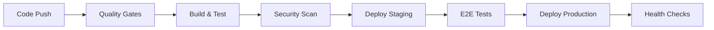

# CI/CD Pipeline Documentation

## Overview

The MyFitness application uses a comprehensive CI/CD pipeline built with GitHub Actions to ensure code quality, security, and reliable deployments. This document outlines the pipeline architecture, workflows, and best practices.

## Table of Contents

1. [Pipeline Architecture](#pipeline-architecture)
2. [Workflows](#workflows)
3. [Environment Configuration](#environment-configuration)
4. [Security Measures](#security-measures)
5. [Performance Monitoring](#performance-monitoring)
6. [Deployment Process](#deployment-process)
7. [Troubleshooting](#troubleshooting)
8. [Best Practices](#best-practices)

## Pipeline Architecture

### Core Components

- **GitHub Actions**: Primary CI/CD platform
- **Vercel**: Deployment platform for staging and production
- **PostgreSQL**: Database for testing and production
- **Docker**: Containerization for consistent environments
- **k6**: Load testing framework
- **Lighthouse CI**: Performance monitoring
- **Pa11y**: Accessibility testing

### Pipeline Stages



## Workflows

### 1. Main CI/CD Workflow (`.github/workflows/ci-cd.yml`)

Triggered on:
- Push to `main` branch
- Pull requests to `main`
- Manual dispatch

**Jobs:**

#### Quality Gates
- Linting (ESLint)
- Type checking (TypeScript)
- Code formatting (Prettier)
- Commit message validation

#### Build and Test
- Unit tests with Jest
- Integration tests
- Test coverage reporting (>80% required)
- Component testing

#### Security Scanning
- npm audit
- Snyk vulnerability scanning
- CodeQL analysis
- Secret detection (TruffleHog)

#### Performance Testing
- Lighthouse CI for Core Web Vitals
- Bundle size analysis
- Performance budget checks

#### Accessibility Testing
- Playwright accessibility tests
- WCAG 2.1 AA compliance
- Keyboard navigation testing

#### Deployment
- Staging deployment (automatic)
- Production deployment (manual approval required)
- Health checks post-deployment

### 2. Nightly Tests (`.github/workflows/nightly-tests.yml`)

Runs daily at 2 AM UTC with extended test suites:

- **Performance regression tests**
- **Load testing with k6**
- **Deep security audit**
- **Full accessibility audit**
- **Cross-browser compatibility testing**

### 3. Security Workflow (`.github/workflows/security.yml`)

Continuous security monitoring:

- **CodeQL analysis** for JavaScript/TypeScript
- **Dependency vulnerability scanning**
- **Container security scanning** (Trivy)
- **Secret detection** (Gitleaks, TruffleHog)
- **SAST with Semgrep**
- **License compliance checking**
- **OpenSSF Scorecard**

### 4. Dependabot Configuration (`.github/dependabot.yml`)

Automated dependency updates:

- Weekly npm updates
- Monthly GitHub Actions updates
- Security patches prioritized
- Grouped updates to reduce noise

## Environment Configuration

### Environment Files

1. **`.env.example`** - Template for environment variables
2. **`.env.staging`** - Staging environment configuration
3. **`.env.production`** - Production environment configuration

### Required Secrets

Configure these in GitHub repository settings:

```yaml
# Database
DATABASE_URL
TEST_DATABASE_URL

# Supabase
NEXT_PUBLIC_SUPABASE_URL
NEXT_PUBLIC_SUPABASE_ANON_KEY
SUPABASE_SERVICE_ROLE_KEY

# Authentication
NEXTAUTH_SECRET

# Vercel
VERCEL_TOKEN
VERCEL_ORG_ID
VERCEL_PROJECT_ID_STAGING
VERCEL_PROJECT_ID_PRODUCTION

# Monitoring
SENTRY_AUTH_TOKEN
SNYK_TOKEN

# Notifications
SLACK_WEBHOOK_URL
```

## Security Measures

### Code Security

1. **Static Analysis**
   - ESLint security plugin
   - TypeScript strict mode
   - Semgrep rules for OWASP Top 10

2. **Dependency Security**
   - Automated vulnerability scanning
   - License compliance checking
   - Supply chain security with Scorecard

3. **Secret Management**
   - GitHub Secrets for sensitive data
   - Environment variable validation
   - Secret scanning in commits

### Runtime Security

1. **Security Headers**
   - CSP (Content Security Policy)
   - HSTS (HTTP Strict Transport Security)
   - X-Frame-Options
   - X-Content-Type-Options

2. **Rate Limiting**
   - API endpoint protection
   - DDoS mitigation
   - Request throttling

## Performance Monitoring

### Metrics Tracked

1. **Core Web Vitals**
   - First Contentful Paint (FCP) < 1.5s
   - Largest Contentful Paint (LCP) < 2.5s
   - Cumulative Layout Shift (CLS) < 0.1
   - First Input Delay (FID) < 100ms

2. **Bundle Size**
   - JavaScript bundle < 200KB (gzipped)
   - CSS bundle < 50KB (gzipped)
   - Image optimization required

3. **API Performance**
   - Response time p95 < 1000ms
   - Error rate < 1%
   - Availability > 99.9%

### Load Testing

Using k6 for load testing with stages:
- Ramp up to 200 concurrent users
- Sustained load for 2 minutes
- Performance thresholds enforced

## Deployment Process

### Staging Deployment

1. Automatic on merge to `main`
2. Runs full test suite
3. Deploys to Vercel staging
4. Runs E2E tests
5. Sends Slack notification

### Production Deployment

1. Manual approval required
2. Creates GitHub release
3. Runs production health checks
4. Deploys to Vercel production
5. Monitors error rates
6. Automatic rollback on failure

### Health Checks

Post-deployment validation:
- API endpoint availability
- Database connectivity
- Authentication flow
- Critical user journeys
- Performance baselines

## Troubleshooting

### Common Issues

1. **Build Failures**
   ```bash
   # Check Node version
   node --version  # Should be 20.x
   
   # Clear cache
   npm ci
   ```

2. **Test Failures**
   ```bash
   # Run tests locally
   npm test
   npm run test:e2e
   ```

3. **Deployment Issues**
   - Check Vercel deployment logs
   - Verify environment variables
   - Review health check results

### Debugging Workflows

1. Enable debug logging:
   ```yaml
   env:
     ACTIONS_STEP_DEBUG: true
   ```

2. Download artifacts for analysis
3. Check workflow run logs
4. Use `act` for local testing

## Best Practices

### Code Quality

1. **Testing**
   - Write tests before code (TDD)
   - Maintain >80% coverage
   - Include E2E tests for critical paths

2. **Code Review**
   - Require PR approval
   - Run automated checks
   - Security review for sensitive changes

### Performance

1. **Optimization**
   - Lazy load components
   - Optimize images
   - Minimize bundle size

2. **Monitoring**
   - Track Core Web Vitals
   - Set performance budgets
   - Regular performance audits

### Security

1. **Development**
   - Never commit secrets
   - Use environment variables
   - Regular dependency updates

2. **Deployment**
   - Use least privilege principles
   - Enable security headers
   - Monitor for vulnerabilities

### Accessibility

1. **Development**
   - Test with screen readers
   - Ensure keyboard navigation
   - Meet WCAG 2.1 AA standards

2. **Testing**
   - Automated accessibility tests
   - Manual testing for complex interactions
   - Regular accessibility audits

## Maintenance

### Regular Tasks

1. **Weekly**
   - Review Dependabot PRs
   - Check security alerts
   - Monitor performance trends

2. **Monthly**
   - Update dependencies
   - Review and optimize workflows
   - Audit access permissions

3. **Quarterly**
   - Security audit
   - Performance optimization
   - Workflow efficiency review

## Resources

- [GitHub Actions Documentation](https://docs.github.com/en/actions)
- [Vercel Documentation](https://vercel.com/docs)
- [k6 Documentation](https://k6.io/docs/)
- [Lighthouse CI Documentation](https://github.com/GoogleChrome/lighthouse-ci)
- [Pa11y Documentation](https://pa11y.org/)

## Support

For CI/CD issues:
1. Check this documentation
2. Review workflow logs
3. Contact DevOps team
4. Create issue in repository

---

Last Updated: January 2025